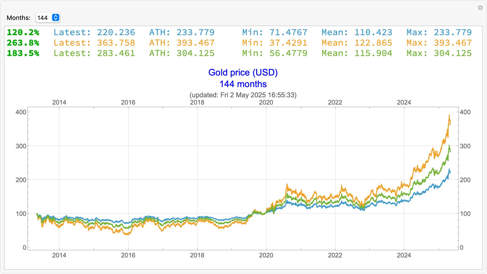

# 📈 FinPlot

A Mathematica function to display and manipulate financial DateListPlots in a generic and flexible way.

```
FinPlot[
  FinancialData["XAU/USD", {1960 - 01 - 01}]
  ,"BTC price (USD)"
  ,<|
    imagesize -> 1000
  |>
]
```



